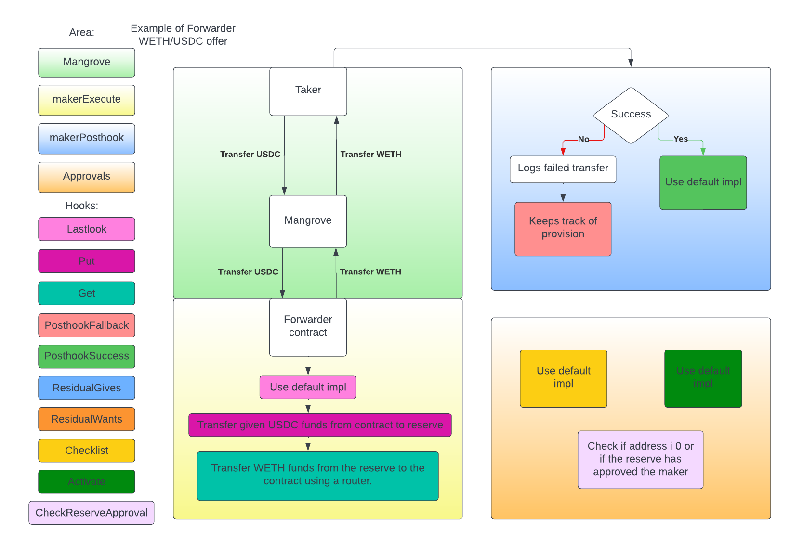

# Forwarder

Forwarder is an abstract implementation of [MangroveOffer](mangrove-offer.md), if you don't have a good understanding of MangroveOffer we recommend reading that page first. This page is going to compare the [Direct](direct.md) implementation of MangroveOffer with Forwarder, we recommend reading about [Direct](direct.md) before reading this page.

Forwarder should be seen as an implementation the can be used by multiple offer makers. This means that anyone can manage offers using the contract. Because of this, Forwarder needs to keep track of who owns which offer and what the reserve is for the caller. This is the key difference between Direct and Forwarder.

Forwarder does many of the same things as MangroveOffer and Direct with a few key differences.

**How inbound tokens are handled (from the taker):** After the funds have been transferred from the taker to the Forwarder contract, it transfers the funds to the reserve of the offer owner. The reason for this, is that it cannot leave the funds on the contract, since the inbound tokens need to be distributed to each offer owners. When the offer has been successfully taken, it has no funds on the contract itself (vs. Direct where the funds are still on the contract). It therefore has no extra actions and just uses the default implementation of MangroveOffer.

**How outbound tokens are handled (for the taker):** Since the contract cannot be used as the reserve for a Forwarder contract, this means that is also has to transfer the funds from the reserve to the Forwarder contract. This is again because multiple users can use the contract.

**Reserve:** When setting the reserve using a Forwarder contract it first checks if the maker is trying to set an empty address. This is allowed and the makers address will be used as the reserve. If the address is not empty, then it checks whether the address has approved the maker to use it as its reserve. This is different than Direct, since Forwarder has multiple makers, it has to keep track on which makers can use a reserve. The reserve needs to call the Forwarder contract to approve a maker. The reserve can also revoke the approval.

**Provision tracking:** If the offer fails, then this means that the taker was given a bounty for using gas trying to take a failing offer. But the bounty for the taker, is not necessarily the same amount as the amount that was provisioned for the offer. If there is still some provision left on the offer, Forwarder keeps track of the remaining provision, that is no longer locked to the offer. The same way it keeps track of who owns an offer it also saves how much free provision is left on the offer.

**Routing:** The Forwarder contract has to use a router, it is not possible to leave the responsibility of transferring the funds to and from the reserve to the contract itself.

Where MangroveOffer has not implementation of posting a new offer, updating offers or retracting offers and Direct has very simple implementation of the methods. Forwarder needs more logic, because it has to keep track of who posts what offer. This means Forwarder keeps an internal map, where it can look up any offer id on any market, and see who owns that offer. When posting a new offer, the offer id is returned. The poster has keep track of on what market they posted and what id was used. If they forget this, there is no way of knowing what offers on which markets, that they own. When updating or retracting an offer, the Forwarder checks whether the caller is the offer owner that the caller is trying to change. If the caller is not the owner, then the transaction reverts.

When posting a new offer, one would usually also fund Mangrove, so that it has enough funds to cover gas and possible bounty. But since it is the Forwarder contract, that is actually doing the posting of the offers and just keeping track of who owns what internally. Then funding Mangrove directly cannot be done, because Mangrove only knows that the Forwarder contract posted the offer, but has no information about who the Forwarder posted on behalf of. Because of this when posting a new offer using Forwarder, it does not require a gasprice, but uses the amount to be funded combined with the gas requirement, to calculate a gas price, that uses all of the funds. This way the offer has enough information, that when an offer is retracted or updated, it can calculated how much provision is left on the offer.

