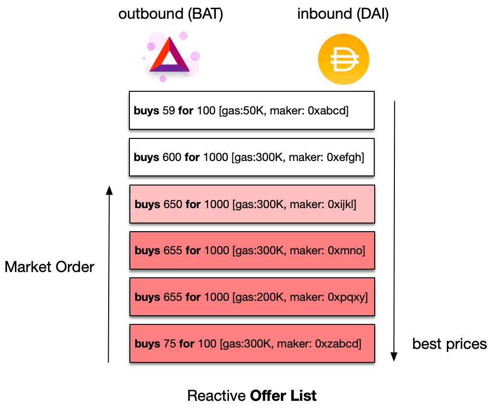
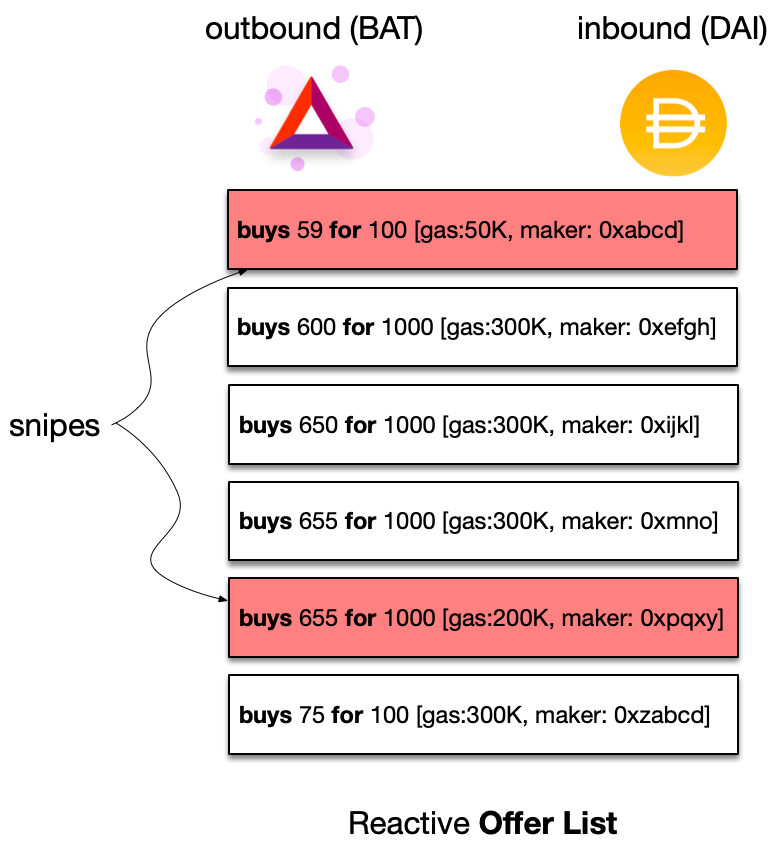

# Taking liquidity

 

### Taking offers

The main way to consume liquidity on Mangrove is through a market order, a configurable type of order that executes offers from best to worst. The [Taking offers](taker-order.md) section details how market orders work, and covers [offer sniping](taker-order.md#offer-sniping) as well, wherein one can target individual offers.

### Cleaning offers

Offers on Mangrove can fail. Liquidity-taking functions can also be used to trigger failing offers and take them out of Mangrove. The [Cleaning offers](cleaning-an-offer.md) section details how to safely trigger failing offers and make a profit doing so.

### Delegation

An allowance mechanism lets you separate the address that provides the funds and the address that originates the buy/sell transactions. The [Delegation](delegate-takers.md) section details how to let other addresses use your funds.
